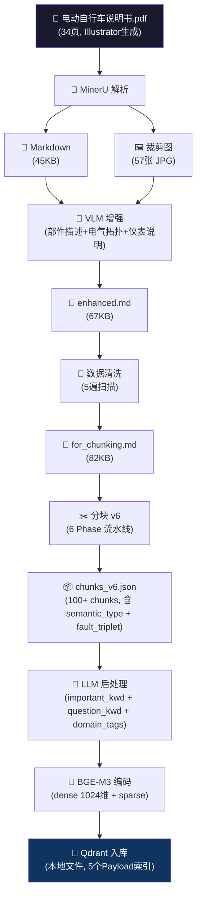
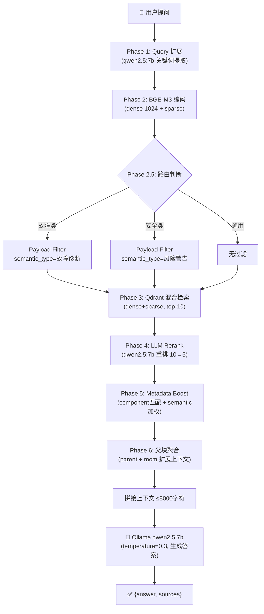

# 雅迪 DM6 电动自行车说明书 · 知识库问答系统

## 系统架构

### 知识库构建流程



### 问答流程



## 技术栈

| 组件 | 选型 | 说明 |
|------|------|------|
| PDF解析 | MinerU | 57张裁剪图 + Markdown输出 |
| 图像理解 | 多模态VLM | 部件图、仪表盘、电气原理图语义提取 |
| 分块引擎 | 自研v6 | 7种语义类型 + 故障三元组 + 上下文挂载 |
| 嵌入模型 | BGE-M3 | 1024维dense + sparse，中英混合最优 |
| 向量数据库 | Qdrant | 本地文件模式，payload索引 |
| 答案生成 | Ollama qwen2.5:7b | 本地推理 |
| 后端 | FastAPI | 异步，Swagger文档 |
| 前端 | 纯HTML+CSS+JS | marked.js渲染Markdown |

## 项目结构

```
ebike-search/
├── docs/                   设计文档
│   ├── 分块方案_v6.md
│   ├── Metadata方案_v6.md
│   └── Retriever方案_v6.md
├── pipeline/               数据管道（一次性执行）
│   ├── parse_and_enhance.py
│   ├── chunker.py
│   └── embed_and_load.py
├── backend/                检索服务（持久运行）
│   ├── search_server.py
│   ├── requirements.txt
│   └── run.bat
├── frontend/
│   └── search.html
└── data/                   数据文件
    ├── qdrant_db/          向量数据库
    ├── chunks_v6.json      分块结果
    └── ...
```

## 快速开始

```bash
# 前提
ollama pull qwen2.5:7b

# 1. 启动后端
cd backend && run.bat
# → Connected. N points.
# → http://localhost:8000

# 2. 打开前端
双击 frontend\search.html

# 3. 提问
输入 "电池怎么充电" → 查看答案和来源
```

## 分块方案亮点

- **7种语义类型**: 操作步骤 / 故障诊断 / 风险警告 / 参数查询 / 部件说明 / 电路拓扑 / 概述说明
- **故障三元组**: symptom → cause → action
- **原子化保护**: 表格 / 警告 / 有序步骤不可切分
- **上下文挂载**: 表格自动挂载前文说明
- **LLM后处理**: 每个chunk生成3个关键词+3个预设问题

## 检索方案亮点

- **Query扩展**: LLM关键词提取，将"车充不进电"展开为"无法充电/充电失败"
- **2路路由**: 故障查询优先召回故障诊断chunk，安全查询过滤风险警告
- **Dense+Sparse混合检索**: BGE-M3原生双向量
- **LLM Rerank**: 10候选 → qwen2.5:7b重排 → 5精选
- **Metadata Boost**: component匹配 + semantic加权 + domain_tag加分
- **父块聚合**: 命中子chunk自动拉取父chunk上下文

## 管道说明

数据管道按顺序执行（一次性）：

```bash
cd pipeline

# Step 1: MinerU解析 + VLM增强
python parse_and_enhance.py --mineru-out ../data --pdf ../data/电动自行车说明书_origin.pdf --output ../data/电动自行车说明书_enhanced.md

# Step 2: 分块
python chunker.py ../data/电动自行车说明书_for_chunking.md ../data/chunks_v6.json

# Step 3: LLM后处理（需要 Ollama 运行中）
python llm_postprocess.py ../data/chunks_v6.json ../data/chunks_v6_llm.json

# Step 4: BGE-M3编码 + Qdrant入库
python embed_and_load.py ../data/chunks_v6_llm.json ../data/qdrant_db
```

## API 接口

| 接口 | 方法 | 说明 |
|------|------|------|
| `/api/health` | GET | 健康检查，返回qdrant点数 |
| `/api/chat` | POST | 问答（非流式），返回answer+sources |
| `/api/chat/stream` | POST | 问答（SSE流式），实时token+sources |
| `/api/debug/context` | POST | 调试用，返回检索上下文 |
| `/docs` | GET | Swagger文档 |
