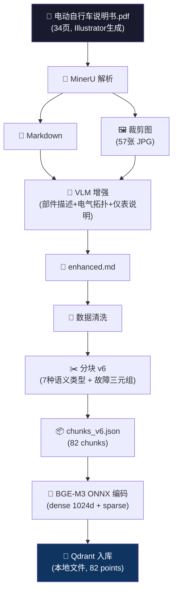
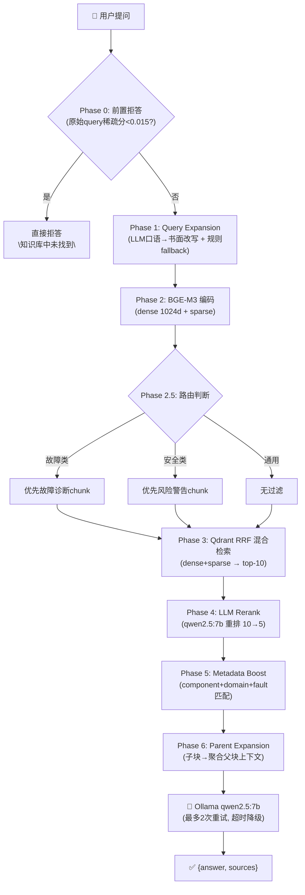

# 雅迪 DM6 电动自行车说明书 · 知识库问答系统

> 📘 **完整项目手册见 [PROJECT.md](./PROJECT.md)** —— 模块级详解、踩坑记录、评测体系、改进路线图

## 系统架构

### 知识库构建流程


```mermaid
flowchart TD
    PDF["📄 电动自行车说明书.pdf\n(34页, Illustrator生成)"]
    PDF --> MINERU["🔧 MinerU 解析"]
    MINERU --> MD["📝 Markdown"]
    MINERU --> IMG["🖼️ 裁剪图\n(57张 JPG)"]
    MD --> VLM["🤖 VLM 增强\n(部件描述+电气拓扑+仪表说明)"]
    IMG --> VLM
    VLM --> ENHANCED["📝 enhanced.md"]
    ENHANCED --> CLEAN["🧹 数据清洗"]
    CLEAN --> CHUNK["✂️ 分块 v6\n(7种语义类型 + 故障三元组)"]
    CHUNK --> CHUNKS["📦 chunks_v6.json\n(82 chunks)"]
    CHUNKS --> EMBED["🧮 BGE-M3 ONNX 编码\n(dense 1024d + sparse)"]
    EMBED --> QDRANT["💾 Qdrant 入库\n(本地文件, 82 points)"]

    style PDF fill:#1a1a2e,color:#fff
    style QDRANT fill:#0f3460,color:#fff
```

### 问答流程


```mermaid
flowchart TD
    Q["👤 用户提问"] --> REJECT{"Phase 0: 前置拒答\n(原始query稀疏分<0.015?)"}
    REJECT -->|是| RJ["直接拒答\n\"知识库中未找到\""]
    REJECT -->|否| QEXP["Phase 1: Query Expansion\n(LLM口语→书面改写 + 规则fallback)"]
    QEXP --> ENC["Phase 2: BGE-M3 编码\n(dense 1024d + sparse)"]
    ENC --> ROUTE{"Phase 2.5: 路由判断"}
    ROUTE -->|故障类| FAULT["优先故障诊断chunk"]
    ROUTE -->|安全类| SAFE["优先风险警告chunk"]
    ROUTE -->|通用| GENROUTE["无过滤"]
    FAULT --> SEARCH["Phase 3: Qdrant RRF 混合检索\n(dense+sparse → top-10)"]
    SAFE --> SEARCH
    GENROUTE --> SEARCH
    SEARCH --> RERANK["Phase 4: LLM Rerank\n(qwen2.5:7b 重排 10→5)"]
    RERANK --> BOOST["Phase 5: Metadata Boost\n(component+domain+fault匹配)"]
    BOOST --> PARENT["Phase 6: Parent Expansion\n(子块→聚合父块上下文)"]
    PARENT --> GEN["🤖 Ollama qwen2.5:7b\n(最多2次重试, 超时降级)"]
    GEN --> ANS["✅ {answer, sources}"]
```

## 技术栈

| 组件 | 选型 | 说明 |
|------|------|------|
| PDF 解析 | MinerU | 57 张裁剪图 + Markdown 输出 |
| 图像理解 | VLM (qwen3-vl:4b) | 部件图、仪表盘、电气原理图语义提取 |
| 分块引擎 | 自研 v6 | 7 种语义类型 + 故障三元组 + parent-child |
| LLM 后处理 | llm_postprocess.py | important_kwd / question_kwd 提取 |
| 嵌入模型 | BGE-M3 ONNX (1024d) | dense + sparse 双路，索引搜索必须同一模型 |
| 向量数据库 | Qdrant 本地文件模式 | 82 points, RRF 混合检索 |
| 答案生成 | Ollama qwen2.5:7b | 本地推理，2 次重试 |
| 后端 | FastAPI | 异步，Swagger 文档 |
| 前端 | 纯 HTML+CSS+JS | Linear 暗色主题，流式输出 |
| Prompt 管理 | YAML 版本仓库 | 自动取最新版本，Git 可回滚 |
| 评测 | eval_retriever.py + eval_answer.py | 50 条测试，5 路并发 |

## 项目结构

```
ebike-search/
├── PROJECT.md               📘 完整项目手册（模块详解+踩坑+路线图）
├── docs/                    设计文档
│   ├── 分块方案_v6.md
│   ├── Metadata方案_v6.md
│   └── Retriever方案_v6.md
├── pipeline/                数据管道（一次性执行）
│   ├── parse_and_enhance.py
│   ├── chunker.py
│   ├── llm_postprocess.py
│   └── embed_and_load.py
├── backend/                 检索服务（持久运行）
│   └── search_server.py
├── prompts/                 Prompt 版本管理
│   ├── query_expand/
│   ├── rerank/
│   └── answer/
├── frontend/
│   ├── search.html          问答页
│   └── chunks.html          Chunk 浏览器
├── tests/                   测试与评测
│   ├── test_set.json        50 条测试数据
│   ├── eval_retriever.py    检索评测
│   ├── eval_answer.py       答案评测
│   ├── diag_vectors.py      检索诊断工具
│   ├── run_eval.bat         一键运行
│   ├── eval_review.md       评审报告
│   ├── retriever_report.md  检索评测结果
│   └── answer_report.md     答案评测结果
├── data/
│   ├── qdrant_db/           向量数据库
│   ├── chunks_v6.json       分块结果 (82 chunks)
│   └── ...
└── models/
    └── bge-m3/              BGE-M3 ONNX 模型
```

## 快速开始

```bash
# 0. 前提
ollama pull qwen2.5:7b

# 1. 启动后端
cd backend && python search_server.py
# → Connected. 82 points.
# → http://localhost:8000

# 2. 打开前端
# 浏览器打开 frontend/search.html

# 3. 测试
curl -X POST http://localhost:8000/api/chat \
  -H "Content-Type: application/json" \
  -d '{"query":"调速失灵怎么修"}'
```

## 评测

```bash
cd tests
python run_eval.bat
# → retriever_report.md + answer_report.md

# 检索诊断（需先停后端——Qdrant 不支持并发）
python diag_vectors.py
```

| 指标 | 当前 | 目标 |
|:---|:---|:---|
| Recall@5（排除概述说明） | **97.8%** | ≥90% ✅ |
| Rejection Rate | 60% | ≥80% |

> 详细评测历程见 [tests/eval_review.md](./tests/eval_review.md)

## 管道说明

数据管道按顺序执行（一次性）：

```bash
cd pipeline

# Step 1: MinerU 解析 + VLM 增强
python parse_and_enhance.py \
  --mineru-out ../data \
  --pdf ../data/电动自行车说明书_origin.pdf \
  --output ../data/电动自行车说明书_enhanced.md

# Step 2: 分块
python chunker.py \
  ../data/电动自行车说明书_for_chunking.md \
  ../data/chunks_v6.json

# Step 3: BGE-M3 编码 + Qdrant 入库
# ⚠️ 必须用 models/bge-m3 (ONNX)，不能是 HF cache (PyTorch)！
python embed_and_load.py ../data/chunks_v6.json ../data/qdrant_db
```

> ⚠️ **关键踩坑**：索引和搜索必须用**完全相同的 BGE-M3 模型文件**。HF PyTorch 版产出的 sparse 向量全为空，ONNX 版正常。混用会导致 Recall 从 84% 跌到 14%。详见 [PROJECT.md §3.6](./PROJECT.md#36-向量嵌入与入库-pipelineembed_and_loadpy)。

## API 接口

| 接口 | 方法 | 说明 |
|------|------|------|
| `/api/health` | GET | 健康检查 |
| `/api/chat` | POST | 问答（非流式），支持 `skip_answer=true` 仅检索 |
| `/api/chat/stream` | POST | 问答（SSE 流式） |
| `/api/debug/context` | POST | 调试用，返回检索上下文 |
| `/docs` | GET | Swagger 文档 |

## 核心特性

- **前置拒答**：原始 query 的 BGE-M3 稀疏分 < 0.015 → 直接拒答，杜绝 LLM 幻觉
- **Query Rewriting**：LLM 口语→书面改写（"灯不亮"→"大灯 不工作 故障"）+ 35+ 条规则 fallback
- **RRF 混合检索**：dense（语义相似）+ sparse（词匹配）双路融合
- **LLM Rerank**：10 候选 → qwen2.5:7b 重排 → 5 精选
- **Metadata Boost**：component 匹配 + domain_tag 加权
- **Parent Expansion**：命中子 chunk 自动拉取父 chunk 上下文
- **Ollama 降级**：超时后 2 次重试，全部失败则输出检索原文
- **Prompt 版本管理**：prompts/ 下 YAML 自动取最新版本，Git 可回滚
