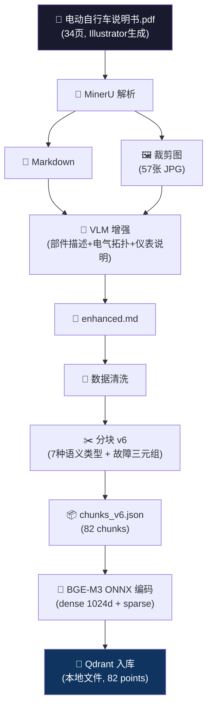
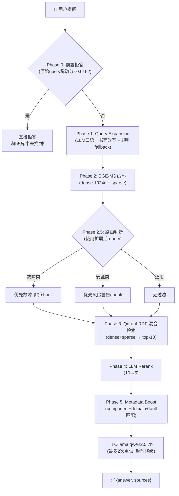

# 雅迪 DM6 电动自行车说明书 · 知识库问答系统

> 📘 **完整项目手册见 [PROJECT.md](./PROJECT.md)** —— 模块级详解、踩坑记录、评测体系、改进路线图

## 系统架构

### 知识库构建流程


```mermaid
flowchart TD
    PDF["📄 电动自行车说明书.pdf\n(34页, Illustrator生成)"]
    PDF --> MINERU["🔧 MinerU 解析"]
    MINERU --> MD["📝 Markdown"]
    MINERU --> IMG["🖼️ 裁剪图\n(57张 JPG)"]
    MD --> VLM["🤖 VLM 增强\n(部件描述+电气拓扑+仪表说明)"]
    IMG --> VLM
    VLM --> ENHANCED["📝 enhanced.md"]
    ENHANCED --> CLEAN["🧹 数据清洗"]
    CLEAN --> CHUNK["✂️ 分块 v6\n(7种语义类型 + 故障三元组)"]
    CHUNK --> CHUNKS["📦 chunks_v6.json\n(82 chunks)"]
    CHUNKS --> EMBED["🧮 BGE-M3 ONNX 编码\n(dense 1024d + sparse)"]
    EMBED --> QDRANT["💾 Qdrant 入库\n(本地文件, 82 points)"]

    style PDF fill:#1a1a2e,color:#fff
    style QDRANT fill:#0f3460,color:#fff
```

### 问答流程 (v6.2)


```mermaid
flowchart TD
    Q["👤 用户提问"] --> REJECT{"Phase 0: 前置拒答\n(原始query稀疏分<0.015?)"}
    REJECT -->|是| RJ["直接拒答\n\"知识库中未找到\""]
    REJECT -->|否| QEXP["Phase 1: Query Expansion\n(LLM口语→书面改写 + 规则fallback)"]
    QEXP --> ENC["Phase 2: BGE-M3 编码\n(dense 1024d + sparse)"]
    ENC --> ROUTE{"Phase 2.5: 路由判断\n(使用扩展后 query)"}
    ROUTE -->|故障类| FAULT["优先故障诊断chunk"]
    ROUTE -->|安全类| SAFE["优先风险警告chunk"]
    ROUTE -->|通用| GENROUTE["无过滤"]
    FAULT --> SEARCH["Phase 3: Qdrant RRF 混合检索\n(dense+sparse → top-10)"]
    SAFE --> SEARCH
    GENROUTE --> SEARCH
    SEARCH --> RERANK["Phase 4: LLM Rerank\n(10→5)"]
    RERANK --> BOOST["Phase 5: Metadata Boost\n(component+domain+fault匹配)"]
    BOOST --> GEN["🤖 Ollama qwen2.5:7b\n(最多2次重试, 超时降级)"]
    GEN --> ANS["✅ {answer, sources}"]
```

---

## 技术栈与选型详解

### PDF 解析：MinerU

| 维度 | 说明 |
|------|------|
| **选型** | MinerU (magic-pdf)，OPPO 开源的 PDF 解析工具 |
| **选型理由** | 本说明书由 Adobe Illustrator 生成，文字以向量路径形式存储而非文本流。PyMuPDF、pdfplumber 等传统工具无法提取此类 PDF 的文字——它们依赖 PDF 内部的文本对象，而 AI 生成 PDF 没有。MinerU 内置布局检测模型（基于 DINO），能识别 Figure/Table/Text 区域位置并裁剪输出 |
| **输出** | 34 页 → Markdown 正文 + 57 张 JPG 裁剪图 |
| **局限** | 表格识别准确率有限，复杂嵌套表格可能误判为纯文本 |

### 图像理解：VLM (qwen3-vl:4b)

| 维度 | 说明 |
|------|------|
| **选型** | Ollama qwen3-vl:4b，通过 base64 编码图像直调 `/api/generate` |
| **选型理由** | 说明书中有电气原理图、仪表盘示意图、部件结构图——这些是纯视觉信息，MinerU 无法提取。VLM 将图像内容转化为结构化文字描述，注入 Markdown 后参与分块和检索 |
| **处理范围** | 57 张 MinerU 裁剪图中识别为"非纯文本"的图像（电路图、示意图、仪表图） |
| **温度** | 0.1（需要确定性描述，不能创造性发挥） |

### 分块引擎：自研 v6

分块是整个 RAG 系统最关键的环节——分块质量直接决定检索上限。

**7 种语义类型**：

| 类型 | 示例 | 策略 |
|------|------|------|
| `操作步骤` | "1. 使用千斤顶抬升前轮…" | 按编号列表逐条切分，保持步骤完整性 |
| `故障诊断` | "E01 电池电压异常 电池老化/接头松动" | 表格行→结构化三元组（故障码+原因+对策） |
| `风险警告` | "禁止16周岁以下人员驾驶" | 每条警告独立成块 |
| `参数查询` | "锂电池最佳工作温度 5°C~35°C" | 参数名+数值绑定，不拆散 |
| `部件说明` | VLM 生成的部件结构描述 | 语义完整性优先 |
| `电路拓扑` | VLM 生成的电气原理图描述 | 节点关系保留 |
| `概述说明` | 章节引言、通用描述 | 按自然段落切分 |

**6 个 Phase 流水线**：

```
Phase 1: 结构解析 → 识别 PART/章节标题，构建文档树
Phase 2: 原子块保护 → 表格行、编号列表不可拆分
Phase 3: 语义分类 → 7 类标注 + component/fault_symptom 提取
Phase 4: 上下文挂载 → parent-child 关系建立（子块挂载到章节标题）
Phase 5: 大小控制 → 目标 80-150 tokens，最大 512 chars，overlap 50
Phase 6: 故障三元组 → (故障症状, 维修动作, 维修等级) 结构化提取
```

**Parent-Child 关系**：

每个 chunk 同时存储 `parent_id`（章节标题 chunk）和 `child_ids`（子块列表）。`_build_context` 组装时自动带上 `[文档名称]` + `[章节]` 元数据，子块天然拥有章节上下文，无需额外扩展。

### 嵌入模型：BGE-M3 ONNX

| 维度 | 说明 |
|------|------|
| **选型** | BAAI/bge-m3，北京智源研究院 |
| **选型理由** | 这是目前唯一同时支持 **dense 1024d + sparse 词权重** 双路编码的中文开源模型。Dense 路捕获语义相似（"调速失灵"↔"油门不走"），Sparse 路实现精确词匹配（"D8F-001" 必须命中该型号）。其他中文嵌入模型（m3e-base、text2vec-large-chinese）只有 dense，无法做混合检索 |
| **ONNX vs PyTorch** | ⚠️ **必须用 ONNX 格式**（`models/bge-m3/` 目录）。HF PyTorch 版产出的 sparse 向量全为空，ONNX 版正常。混用会导致 Recall 从 84% 跌到 14%。这是本项目最大的踩坑记录 |
| **部署** | CPU 推理，首次加载 ~10s，encode 速度 ~50ms/条 |

### 向量数据库：Qdrant 本地文件模式

| 维度 | 说明 |
|------|------|
| **选型** | Qdrant，Rust 编写的向量数据库 |
| **模式** | 本地文件模式（零运维，无需 Docker） |
| **选型理由** | Qdrant 原生支持 dense + sparse 双向量存储和 RRF（Reciprocal Rank Fusion）混合检索，不需要在应用层手动融合。Milvus 的 sparse 支持需要额外配置；Chroma 不支持 sparse |
| **规模** | 82 points，单文件 ~50MB |
| **局限** | 本地模式不支持并发访问（独占锁）。评测脚本和服务器不能同时运行。数据量到万级需迁移到 Qdrant Server |

**RRF 混合检索公式**：

```
RRF_score(d) = Σ 1/(k + rank_i(d))
其中 k=60（平滑参数），rank_i 为第 i 路检索器中文档 d 的排名
```

Dense 和 Sparse 各取 40 条候选 → RRF 融合排序 → 取 Top-10。

### 前置拒答：BGE-M3 稀疏分阈值

| 维度 | 说明 |
|------|------|
| **机制** | 对原始 query（不做扩展）做 BGE-M3 稀疏编码 → Qdrant sparse-only 搜索取 top-1 score → 若 < 0.015 则直接拒答 |
| **原理** | BGE-M3 的稀疏向量本质是 token-level 词权重。如果查询词在 82 个 chunk 中从未出现，sparse 分数接近 0。这比手写拒答词表更可靠——自动覆盖所有"说明书不存在的内容" |
| **阈值** | 0.015，基于 2 个校准案例："蓝牙"~0.002，"续航"~0.027 |
| **适用范围** | `/api/chat` 和 `/api/chat/stream` 两端点均已覆盖 |

### Query 扩展：LLM + 规则双保险

```
口语输入: "灯不亮"
  ↓ LLM 改写 (prompt v2, few-shot)
书面输出: "大灯 不工作 故障"
  ↓ LLM 失败时 fallback
规则输出: 35+ 条映射 → "不工作 故障 大灯"
```

| 维度 | 说明 |
|------|------|
| **LLM 路径** | qwen2.5:7b，prompt v2（口语→书面改写，缩写展开，短查询补全），few-shot 示例弥补 7B 模型能力 |
| **规则路径** | 35+ 条硬编码映射表，LLM 超时/崩溃时自动切换 |
| **设计理念** | 练习项目中的生产实践——LLM 不可靠时规则兜底，总比裸查询强 |

### 查询路由

| 维度 | 说明 |
|------|------|
| **分类** | 故障类（12 关键词：故障、不工作、坏了…）→ 无过滤，标记故障诊断优先；安全类（6 关键词：安全、危险、警告…）→ **硬过滤**，仅检索 semantic_type="风险警告" 的 chunk；通用类 → 无过滤 |
| **执行时机** | Phase 2.5，在 Query 扩展**之后**——使用扩展后的 query 做路由判断，避免"车子一顿一顿的"（不含关键词）被误判为通用 |

### LLM 重排

| 维度 | 说明 |
|------|------|
| **方式** | qwen2.5:7b，listwise 重排——输入 10 条候选，要求输出编号列表（如"3,7,1,5,2"），取前 5 条 |
| **选型理由** | RRF 融合后的 Top-10 排序精度不够（语义排序 + 词匹配排序简单融合），需要二次精排 |
| **局限** | Listwise 方式对 7B 模型不可靠——模型容易只认真读前几条候选。生产环境应换 cross-encoder（如 bge-reranker-v2-m3），延迟从 ~2s 降到 ~100ms 且无需解析 LLM 输出 |
| **降级** | 解析失败时回退到取前 5 条，不报错 |

### Metadata Boost

| 维度 | 说明 |
|------|------|
| **机制** | 对重排后的结果做分数微调：component 匹配 +0.15，fault_symptom 词重叠 +0.1×n，semantic_type 匹配 +0.1~0.15 |
| **上限** | max 0.3（加权后裁剪） |
| **执行时机** | 重排之后——作为精排微调（前提是重排的 top-5 已足够好，Recall@5=97.8% 满足此前提） |

### 答案生成

| 维度 | 说明 |
|------|------|
| **模型** | Ollama qwen2.5:7b，temperature=0.3，max 512 tokens |
| **Prompt** | 三层约束——仅依据检索结果、逐条编号+来源引用、不知道就说"知识库中未找到" |
| **重试** | 超时后最多 2 次重试，全部失败则降级返回检索原文（不报 500） |
| **流式** | `/api/chat/stream` 通过 SSE 推送 token，前端实现打字效果 |
| **拒答一致性** | 两端点行为一致——Phase 0 在生成前拦截，避免 LLM 基于不相关上下文胡编 |

---

## 项目结构

```
ebike-search/
├── PROJECT.md               📘 完整项目手册（模块详解+踩坑+路线图）
├── docs/                    设计文档
│   ├── 分块方案_v6.md
│   ├── Metadata方案_v6.md
│   └── Retriever方案_v6.md
├── pipeline/                数据管道（一次性执行）
│   ├── parse_and_enhance.py
│   ├── chunker.py
│   ├── llm_postprocess.py
│   └── embed_and_load.py
├── backend/                 检索服务（持久运行）
│   ├── search_server.py     FastAPI 主服务 (v6.2, ~1350行)
│   └── config.json
├── prompts/                 Prompt 版本管理
│   ├── query_expand/
│   ├── rerank/
│   └── answer/
├── frontend/
│   ├── search.html          问答页
│   └── chunks.html          Chunk 浏览器
├── tests/                   测试与评测
│   ├── test_set.json        50 条测试数据
│   ├── eval_retriever.py    检索评测
│   ├── eval_answer.py       答案评测
│   ├── diag_vectors.py      检索诊断工具
│   ├── run_eval.bat         一键运行
│   ├── eval_review.md       评审报告
│   ├── retriever_report.md  检索评测结果
│   └── answer_report.md     答案评测结果
├── data/
│   ├── qdrant_db/           向量数据库
│   ├── chunks_v6.json       分块结果 (82 chunks)
│   └── ...
└── models/
    └── bge-m3/              BGE-M3 ONNX 模型
```

---

## 快速开始

```bash
# 0. 前提
ollama pull qwen2.5:7b

# 1. 启动后端
cd backend && python search_server.py
# → Connected. 82 points.
# → http://localhost:8000

# 2. 打开前端
# 浏览器打开 frontend/search.html

# 3. 测试
curl -X POST http://localhost:8000/api/chat \
  -H "Content-Type: application/json" \
  -d '{"query":"调速失灵怎么修"}'
```

---

## 评测

```bash
cd tests
python run_eval.bat
# → retriever_report.md + answer_report.md

# 检索诊断（需先停后端——Qdrant 不支持并发）
python diag_vectors.py
```

| 指标 | 当前 | 目标 |
|:---|:---|:---|
| Recall@5（排除概述说明） | **97.8%** | ≥90% ✅ |
| Rejection Rate | 60% | ≥80% |

> 详细评测历程见 [tests/eval_review.md](./tests/eval_review.md)

---

## 管道说明

数据管道按顺序执行（一次性）：

```bash
cd pipeline

# Step 1: MinerU 解析 + VLM 增强
python parse_and_enhance.py \
  --mineru-out ../data \
  --pdf ../data/电动自行车说明书_origin.pdf \
  --output ../data/电动自行车说明书_enhanced.md

# Step 2: 分块
python chunker.py \
  ../data/电动自行车说明书_for_chunking.md \
  ../data/chunks_v6.json

# Step 3: BGE-M3 编码 + Qdrant 入库
# ⚠️ 必须用 models/bge-m3 (ONNX)，不能是 HF cache (PyTorch)！
python embed_and_load.py ../data/chunks_v6.json ../data/qdrant_db
```

> ⚠️ **关键踩坑**：索引和搜索必须用**完全相同的 BGE-M3 模型文件**。HF PyTorch 版产出的 sparse 向量全为空，ONNX 版正常。混用会导致 Recall 从 84% 跌到 14%。详见 [PROJECT.md §3.6](./PROJECT.md#36-向量嵌入与入库-pipelineembed_and_loadpy)。

---

## API 接口

| 接口 | 方法 | 说明 |
|------|------|------|
| `/api/health` | GET | 健康检查 |
| `/api/chat` | POST | 问答（非流式），含 Phase 0 拒答，支持 `skip_answer=true` 仅检索 |
| `/api/chat/stream` | POST | 问答（SSE 流式），含 Phase 0 拒答 |
| `/api/debug/context` | POST | 调试用，返回检索上下文 |
| `/docs` | GET | Swagger 文档 |

---

## 核心特性

| 特性 | 说明 |
|------|------|
| **前置拒答** | Phase 0：原始 query BGE-M3 稀疏分 < 0.015 → 直接拒答，杜绝 LLM 幻觉。两端点行为一致 |
| **Query Rewriting** | Phase 1：LLM 口语→书面改写 + 35+ 条规则 fallback，双保险设计 |
| **查询路由** | Phase 2.5：使用扩展后 query 做故障/安全/通用三路路由，安全类硬过滤仅搜风险警告 |
| **RRF 混合检索** | Phase 3：dense（语义相似）+ sparse（词匹配）双路融合 |
| **LLM Rerank** | Phase 4：10 候选 → qwen2.5:7b 重排 → 5 精选 |
| **Metadata Boost** | Phase 5：component 匹配 + domain_tag 加权，精排微调 |
| **Ollama 降级** | 超时后 2 次重试，全部失败则输出检索原文（不报 500） |
| **Prompt 版本管理** | `prompts/` 下 YAML 自动取最新版本，Git 可回滚 |
